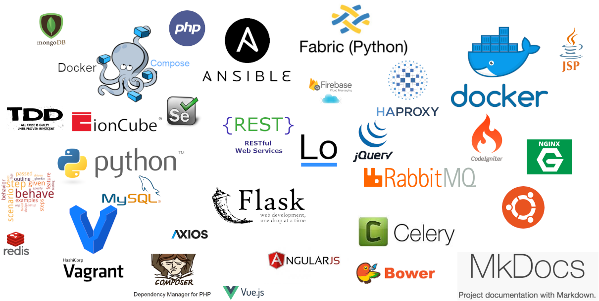

- Working Environment : Manjaro(Prefer), Mac
- Web crawling using python requests library and regular expression
- Web crawling using Selenium WebDriver and Javascript 
- Collecting products from various shopping mall and watch them and update 
- Downloading images and resize then transfer them to China image servers and manage them.
- php, composer, mvc, codeigniter
- jquery, vuejs, angularjs, lodash
- spa, restful api
- python (flask, flask-restful, celery, fabric)
- message queue(RabbitMQ)
- docker/docker-compose ( build image and volume )
- mongodb, redis, mysql
- tdd & bdd
- vagrant
- FCM ( Firebase Cloud Messaging )
- ansible 
- Docker swarm

