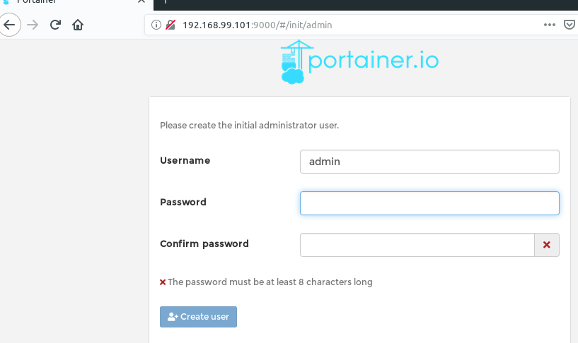

- create yaml file for portainer stack.

```yaml
version: '3.7'

services:
  agent:
    image: portainer/agent
    environment:
      AGENT_CLUSTER_ADDR: tasks.portainer_agent
    volumes:
      - /var/run/docker.sock:/var/run/docker.sock
      - /var/lib/docker/volumes:/var/lib/docker/volumes
    networks:
      - portainer-net
    deploy:
      mode: global
  management:
    image: portainer/portainer
    command: -H tcp://tasks.portainer_agent:9001 --tlsskipverify
    ports:
      - '9000:9000'
    environment:
      TZ: Asia/Seoul
    volumes:
      - portainer_data:/data
    networks:
      - portainer-net
      - {{ nginx_config['network_name'] }}
    deploy:
      mode: replicated
      replicas: 1
      placement:
        constraints:
          - node.role == manager

networks:
  portainer-net:
    driver: overlay


volumes:
  portainer_data:
```

- set manager node as working environment

```bash
$ eval "$(docker-machine env myvm1)"
```

- deploy portainer stack to swarm cluster.

```bash
$ docker stack deploy -c portainer.yml portainer
$ docker service ls

ID                  NAME                   MODE                REPLICAS            IMAGE                        PORTS
ojmgvlv3ehcf        portainer_agent        global              3/3                 portainer/agent:latest       
lrjatf7gv6lp        portainer_management   replicated          1/1                 portainer/portainer:latest   *:9000->9000/tcp
```

- check docker-machine ip address

```bash
$ docker-machine ls
NAME    ACTIVE   DRIVER       STATE     URL                         SWARM   DOCKER     ERRORS
myvm1   *        virtualbox   Running   tcp://192.168.99.101:2376           v18.09.5   
myvm2   -        virtualbox   Running   tcp://192.168.99.102:2376           v18.09.5   
myvm3   -        virtualbox   Running   tcp://192.168.99.103:2376           v18.09.5 

```

[](https://asciinema.org/a/R6VE7jKrB4G9HyBKdN2mf3jun)

- visit master node (192.168.99.101) with 9000 port



