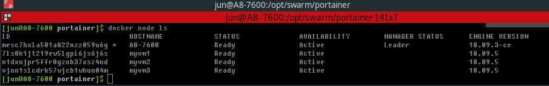

[Portainer - Making Docker Management Easy.](/docker/2019/04/02/portainer-making-docker-management-easy)

- current swarm cluster node list



to make it clear, remove previous data from stack and volume.

```bash
$ docker stack rm portainer
$ docker volume rm portainer_portainer_data

$ docker service ls
$ docker volume ls
```

move yaml file to a /opt/swarm/portainer directory and start a service.  

```bash
$ cd /opt/swarm/portainer
/opt/swarm/portainer@ $ docker stack deploy -c portainer.yml portainer
/opt/swarm/portainer@ $ docker inspect portainer_data
```

inspect volume data and check the directory in the mountpoint.

```bash
$ docker volume inspect portainer_portainer_data 
[
    {
        "CreatedAt": "2019-04-15T21:31:37+09:00",
        "Driver": "local",
        "Labels": {
            "com.docker.stack.namespace": "portainer"
        },
        "Mountpoint": "/var/lib/docker/volumes/portainer_portainer_data/_data",
        "Name": "portainer_portainer_data",
        "Options": null,
        "Scope": "local"
    }
]

$ sudo ls -al /var/lib/docker/volumes/portainer_portainer_data/_data
total 144
drwxr-xr-x 5 root root   4096  4월 15 21:31 .
drwxr-xr-x 3 root root   4096  4월 15 21:31 ..
drwx------ 2 root root   4096  4월 15 21:31 bin
drwx------ 2 root root   4096  4월 15 21:31 compose
-rw-r--r-- 1 root root    389  4월 15 21:31 config.json
-rw------- 1 root root 131072  4월 15 21:31 portainer.db
-rw------- 1 root root    227  4월 15 21:31 portainer.key
-rw------- 1 root root    190  4월 15 21:31 portainer.pub
drwx------ 2 root root   4096  4월 15 21:31 tls
```

[](https://asciinema.org/a/8hDRpZTQoKrFOqkn3Bn3JRvMy)


As we check at the beginning of this post, all the files and directories on `/var/lib/docker/volumes/portainer_portainer_data/_data` will be deleted by removing portainer_data volume. 
To make it persistent, made some changes on volume section like this.

```yaml
volumes:
  portainer_data:
    driver: local
    driver_opts:
      type: none
      device: /opt/swarm/portainer/data
      o: bind
```

Then repeat previous actions.

```bash
$ docker volume inspect portainer_portainer_data
[
    {
        "CreatedAt": "2019-04-15T21:53:20+09:00",
        "Driver": "local",
        "Labels": {
            "com.docker.stack.namespace": "portainer"
        },
        "Mountpoint": "/var/lib/docker/volumes/portainer_portainer_data/_data",
        "Name": "portainer_portainer_data",
        "Options": {
            "device": "/opt/portainer",
            "o": "bind",
            "type": "none"
        },
        "Scope": "local"
    }
]
$ sudo ls -al /opt/swarm/portainer/data
total 132
drwxr-xr-x 5 jun  jun    4096  4월 15 21:53 .
drwxr-xr-x 3 jun  jun    4096  4월 15 21:52 ..
drwx------ 2 root root   4096  4월 15 21:47 bin
drwx------ 2 root root   4096  4월 15 21:47 compose
-rw-r--r-- 1 root root    389  4월 15 21:53 config.json
-rw------- 1 root root 131072  4월 15 21:53 portainer.db
-rw------- 1 root root    227  4월 15 21:53 portainer.key
-rw------- 1 root root    190  4월 15 21:53 portainer.pub
drwx------ 2 root root   4096  4월 15 21:47 tls

$ sudo ls -al /var/lib/docker/volumes/portainer_portainer_data/_data
total 132
drwxr-xr-x 5 jun  jun    4096  4월 15 21:53 .
drwxr-xr-x 3 root root   4096  4월 15 21:53 ..
drwx------ 2 root root   4096  4월 15 21:47 bin
drwx------ 2 root root   4096  4월 15 21:47 compose
-rw-r--r-- 1 root root    389  4월 15 21:53 config.json
-rw------- 1 root root 131072  4월 15 21:53 portainer.db
-rw------- 1 root root    227  4월 15 21:53 portainer.key
-rw------- 1 root root    190  4월 15 21:53 portainer.pub
drwx------ 2 root root   4096  4월 15 21:47 tls
```

[](https://asciinema.org/a/54KATbTzY3viIg7shXQkTW5K8)

Now, all the files under /opt/swarm/portainer/data will keep remain though the portainer stack removed. 