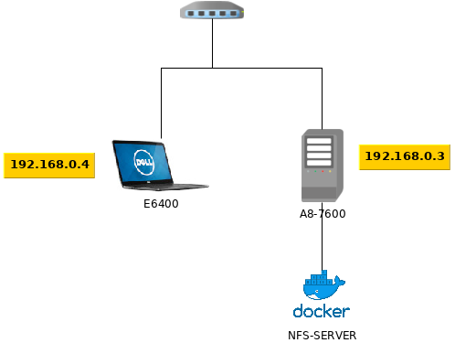
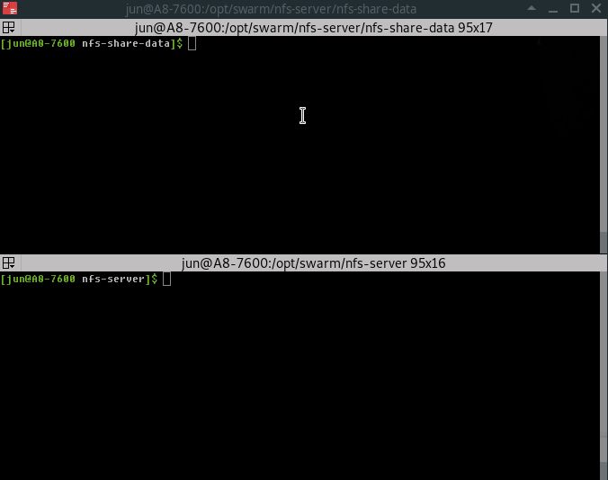

To test nfs-server, i prepared 2 resources. Both are under manjaro OS, docker has been installed.
And for nfs, had to install following package. 
```bash
$ yay -S nfs-utils
```

on Ubuntu, 

```bash
$ apt-get install nfs-common
```


## On a machine - A8-7600 : Running a server 

#### Directory structure.

```
/opt
 /swarm
   /nfs-server
     - docker-compose.yml
     - exports.txt
     /nfs-share-data
```

#### 1. create directory recursively.

```bash
$ mkdir -p /opt/swarm/nfs-server/nfs-share-data
```

#### 2. create following yaml file for nfs container running.

docker-compose.yml
```yaml
version: '3.7'

services:
  nfs:
    image: erichough/nfs-server:2.2.1
    container_name: nfs-server
    ports:
      - '2049:2049'
    privileged: true
    volumes:
      - ./nfs-share-data:/data
      - ./exports.txt:/etc/exports
    network_mode: "host"
    restart: always
```

#### 3. create a exports.txt file to mount a container.

```
/data *(rw,fsid=0,sync,no_subtree_check,no_auth_nlm,insecure,no_root_squash)
```

#### 4. run nfs server

```bash
$ docker-compose up -d
```

[](https://asciinema.org/a/BHNmOrdVihGn3Q7d9Rp0tkO1u)

## On a machine - E6400 : client test

#### 1. Connect to a clinet machine 

```bash
$ ssh 192.168.0.4
```

#### 2. create directory 

```bash
$ sudo mkdir /opt/nfs-data
```

#### 3. mount 

```bash
$ sudo mount -v 192.168.0.3:/ /opt/nfs-data
```
[](https://asciinema.org/a/Vjn1H69CXN89jJXXsYjIE99GW)

## Check nfs working

1. open terminals for server and client.
2. on server side, create a file.
3. on client side, check the file exists.
4. edit the file on the client.
4. check the content of the file on both side.

